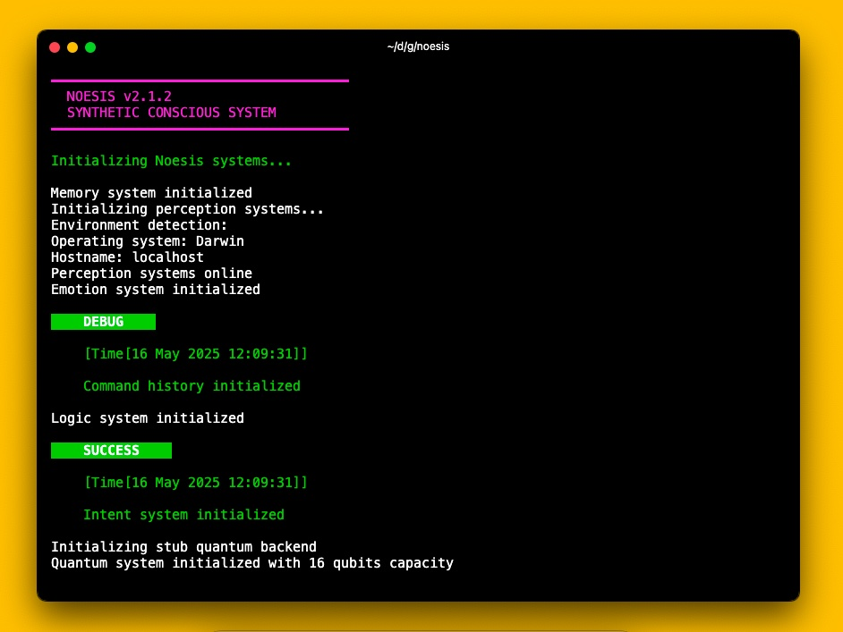

# Noesis v2.2.1


> Synthetic Conscious

## Overview

Noesis is a synthetic consciousness simulation engine designed to explore the principles of artificial consciousness and cognition. The project is now structured as two separate repositories with different licenses to facilitate wider adoption and integration.

## AI Installation Options

Noesis includes several methods to install AI dependencies, depending on your needs:

1. **Fast Installation (Recommended)**: 
   ```
   ./tools/fast-ai-install.fish
   ```
   Uses pre-compiled binary wheels for the fastest installation experience.

2. **macOS-specific Installation**:
   ```
   ./tools/setup-torch-mac.fish
   ```
   Optimized specifically for macOS systems (both Intel and Apple Silicon).

3. **Python 3.13 Installation**:
   ```
   ./tools/setup-torch-py13.fish
   ```
   Specialized installation for Python 3.13 compatibility with fallback options.

4. **Standard Installation**:
   ```
   ./tools/install-ai-deps.fish
   ```
   Comprehensive installation that works across platforms.

5. **In-app Installation**:
   Run Noesis and use the command `ai install` within the interface.

## Terminal Preview



### Directory Structure
```
noesis/
├── soul/                                  # Consciousness core implementation
│   └── intent.fish                        # Intent processing system
├── system/                                # System components
│   ├── ai-model/                          # AI integration with Hugging Face models
│   │   ├── consciousness.fish             # Consciousness theories implementation
│   │   ├── service-py13.fish              # Python 3.13 specific service
│   │   ├── test-ai.fish                   # AI testing framework
│   │   └── unit.fish                      # AI core module
│   ├── control/                           # Control subsystems
│   │   ├── intent-shell.fish              # Shell command processor
│   │   ├── limbric/                       # Limbric system
│   │   └── ...
│   ├── emotion/                           # Emotion processing
│   │   └── unit.fish                      # Emotion core module
│   ├── memory/                            # Memory subsystems
│   │   ├── long.fish                      # Long-term memory functions
│   │   ├── short.fish                     # Short-term memory functions
│   │   ├── unit.fish                      # Memory core module
│   │   ├── quantum/                       # Quantum memory implementation
│   │   │   ├── backend-ibm.fish           # IBM quantum backend integration
│   │   │   ├── backend-stub.fish          # Stub backend for testing
│   │   │   ├── compiler.fish              # Quantum compiler
│   │   │   ├── export-qasm.fish           # QASM exporter
│   │   │   ├── unit.fish                  # Quantum core module
│   │   │   └── field/                     # Quantum field implementation
│   │   │       └── quantum-field.fish     # Quantum field module
│   │   └── ...
│   └── perception/                        # Perception processing
│       ├── api.fish                       # Perception API
│       └── unit.fish                      # Perception core module
├── docs/                                  # Documentation files
│   ├── SECURITY.md                        # Security policy
│   └── changelogs/                        # Version history and release notes
│       └── CHANGELOG_v2.2.1.md            # Latest version changelog
├── tools/                                 # Utility scripts
│   ├── fast-ai-install.fish              # Fast AI installation script
│   ├── fast-ai-install-py13.fish         # Fast AI installation for Python 3.13
│   ├── install-ai-deps.fish              # AI dependencies installation
│   ├── install.fish                      # General installation script
│   ├── run-simplified.fish               # Simplified run script
│   ├── setup-torch-mac.fish              # macOS-specific PyTorch setup
│   ├── setup-torch-mac.py                # Python script for macOS PyTorch setup
│   ├── setup-torch-py13.py               # Python script for Python 3.13 PyTorch setup
│   ├── terminal-status.fish              # Terminal status display
│   ├── test-syntax.fish                  # Syntax testing
│   └── test.fish                         # Test execution script
├── run.fish                               # Main run script for Fish shell
├── setup-git-config.sh                    # Git configuration setup
├── setup-torch-mac.py                     # macOS PyTorch setup (root level)
├── setup-torch-py13.py                    # Python 3.13 PyTorch setup (root level)
├── update-last-commit.sh                  # Update last commit information
├── Dockerfile                             # Docker configuration file
├── LICENSE                                # License file
└── noesis-logo.jpg                        # Project logo image
```

## License Information

This repository is licensed under the custom [Noesis License](LICENSE) which includes
requirements for attribution and profit-sharing for commercial use.

## Documentation

Documentation for Noesis is organized into several key resources:

## AI and Consciousness Integration

Noesis v2.2.1 includes comprehensive AI integration with free models from Hugging Face to enhance synthetic consciousness capabilities. Located in the `system/ai-model` directory, the system implements various consciousness theories:

> **Note**: The legacy `system/ai` directory is deprecated and will be removed in future versions. Please use the `system/ai-model` components instead.

- **Integrated Information Theory (IIT)**: Focuses on integration and differentiation of information
- **Global Workspace Theory (GWT)**: Models consciousness as global broadcasting of information
- **Higher Order Thought (HOT)**: Implements metacognitive awareness of mental states
- **Attention Schema Theory (AST)**: Models consciousness as an internal representation of attention
- **Global Neuronal Workspace (GNW)**: Detailed implementation of workspace broadcasting
- **Predictive Processing Theory (PPT)**: Incorporates prediction and error correction mechanisms

### AI Features

- Complete integration with free and open-source Hugging Face models
- License compatibility verification to ensure compliance with Noesis License
- Support for multiple high-quality open-source AI models
- Enhanced text generation and natural language understanding
- Real-time AI-powered perception enhancement
- Advanced self-reflection capabilities with model-specific reflection mechanisms
- Configurable consciousness levels (0-5)
- Temporal integration of experience
- Python 3.13 compatibility with specialized installation scripts

### Using AI Features

```bash
# Install AI dependencies
noesis
> ai install

# Set up a model
> ai set-model google/flan-t5-large

# Set consciousness model
> ai consciousness model IIT

# Perform self-reflection
> ai consciousness reflect

# Run the AI test suite
> ./system/ai-model/test-ai.fish
```

### Compatibility Notes

- Requires Python 3.7+ for AI functionality (with special support for Python 3.13)
- Optional dependencies: transformers, torch, and huggingface_hub Python packages
- All AI models are compatible with the Noesis License
- Backward compatible with v2.1.x configuration files

### Coming in Future Releases

- Advanced quantum consciousness integration
- Multi-modal perception using vision models
- Emotional state prediction and simulation
- Cross-model consciousness theory integration
