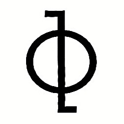

# Noesis v2.1.0



> Synthetic Conscious

## Overview

Noesis is a synthetic consciousness simulation engine designed to explore the principles of artificial consciousness and cognition. The project is now structured as two separate repositories with different licenses to facilitate wider adoption and integration.

### Directory Structure
```
noesis/
├── soul/                                  # Consciousness core implementation
│   └── intent.fish                        # Intent processing system
├── system/                                # System components
│   ├── control/                           # Control subsystems
│   │   ├── limbric/                       # Limbric system
│   │   └── ...
│   ├── emotion/                           # Emotion processing
│   ├── memory/                            # Memory subsystems
│   │   ├── quantum/                       # Quantum memory implementation
│   │   │   └── field/                     # Quantum field implementation
│   │   └── ...
│   └── perception/                        # Perception processing
├── docs/                                  # Documentation files
│   ├── SECURITY.md                        # Security policy
│   └── changelogs/                        # Version history and release notes
│       └── CHANGELOG_v2.1.0.md            # Latest version changelog
├── build.fish                             # Main build script for Fish shell
├── run.fish                               # Main run script for Fish shell
├── test.fish                              # Test execution script
├── install.fish                           # Installation script
├── Dockerfile                             # Docker configuration file
├── LICENSE                                # License file
└── noesis-logo.jpg                        # Project logo image
```

## License Information

This repository is licensed under the custom [Noesis License](LICENSE) which includes
requirements for attribution and profit-sharing for commercial use.

## Documentation

Documentation for Noesis is organized into several key resources:

- **Changelogs** - Complete version history with detailed changes:
  - [CHANGELOG_v2.1.0.md](docs/changelogs/CHANGELOG_v2.1.0.md) (Current release)
  - [CHANGELOG_v2.0.0.md](docs/changelogs/CHANGELOG_v2.0.0.md)
  - [CHANGELOG_v1.2.0.md](docs/changelogs/CHANGELOG_v1.2.0.md)
  - [CHANGELOG_v1.1.0.md](docs/changelogs/CHANGELOG_v1.1.0.md)
  - [CHANGELOG_v1.0.0.md](docs/changelogs/CHANGELOG_v1.0.0.md)
  - [CHANGELOG_v0.2.0.md](docs/changelogs/CHANGELOG_v0.2.0.md)
  - [CHANGELOG_v0.1.2.md](docs/changelogs/CHANGELOG_v0.1.2.md)
  - [CHANGELOG_v0.1.1.md](docs/changelogs/CHANGELOG_v0.1.1.md)