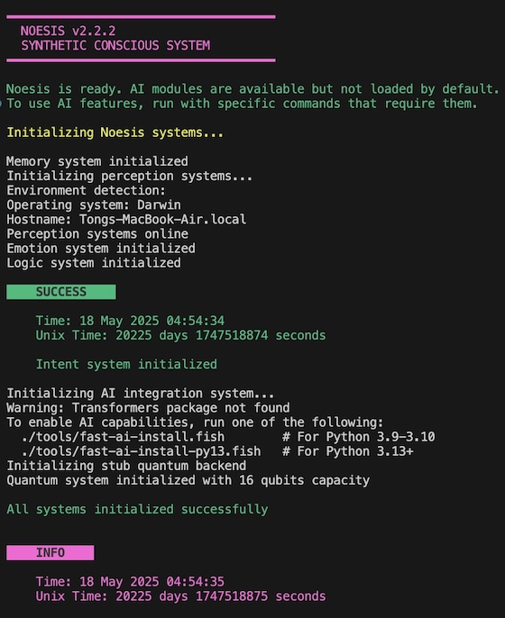

# Noesis v2.2.0


> Synthetic Conscious

## Overview

Noesis is a synthetic consciousness simulation engine designed to explore the principles of artificial consciousness and cognition. The project is now structured as two separate repositories with different licenses to facilitate wider adoption and integration.

## Terminal Preview



### Directory Structure
```
noesis/
├── soul/                                  # Consciousness core implementation
│   └── intent.fish                        # Intent processing system
├── system/                                # System components
│   ├── ai/                                # AI integration with Hugging Face models
│   │   └── consciousness.fish             # Consciousness theories implementation
│   ├── control/                           # Control subsystems
│   │   ├── limbric/                       # Limbric system
│   │   └── ...
│   ├── emotion/                           # Emotion processing
│   ├── memory/                            # Memory subsystems
│   │   ├── quantum/                       # Quantum memory implementation
│   │   │   └── field/                     # Quantum field implementation
│   │   └── ...
│   └── perception/                        # Perception processing
├── docs/                                  # Documentation files
│   ├── SECURITY.md                        # Security policy
│   └── changelogs/                        # Version history and release notes
│       └── CHANGELOG_v2.2.0.md            # Latest version changelog
├── build.fish                             # Main build script for Fish shell
├── run.fish                               # Main run script for Fish shell
├── test.fish                              # Test execution script
├── install.fish                           # Installation script
├── Dockerfile                             # Docker configuration file
├── LICENSE                                # License file
└── noesis-logo.jpg                        # Project logo image
```

## License Information

This repository is licensed under the custom [Noesis License](LICENSE) which includes
requirements for attribution and profit-sharing for commercial use.

## Documentation

Documentation for Noesis is organized into several key resources:

## AI and Consciousness Integration

Noesis v2.2.0 now includes AI integration with free models from Hugging Face to enhance the synthetic consciousness capabilities. The system implements various consciousness theories:

- **Integrated Information Theory (IIT)**: Focuses on integration and differentiation of information
- **Global Workspace Theory (GWT)**: Models consciousness as global broadcasting of information
- **Higher Order Thought (HOT)**: Implements metacognitive awareness of mental states
- **Attention Schema Theory (AST)**: Models consciousness as an internal representation of attention
- **Global Neuronal Workspace (GNW)**: Detailed implementation of workspace broadcasting
- **Predictive Processing Theory (PPT)**: Incorporates prediction and error correction mechanisms

### AI Features

- Integration with free Hugging Face models (MIT, Apache 2.0 licensed)
- License compatibility checking with Noesis License
- Enhanced perception and emotion processing
- Introspection capabilities
- Self-reflection based on consciousness theories

### Using AI Features

```bash
# Install AI dependencies
noesis
> ai install

# Set up a model
> ai set-model google/flan-t5-large

# Set consciousness model
> ai consciousness model IIT

# Perform self-reflection
> ai consciousness reflect
```

Note: AI features require Python 3 with the `transformers` and `torch` packages installed.