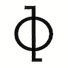

# Noesis v2.0.0



> Synthetic Conscious

## Overview

Noesis is a synthetic consciousness simulation engine designed to explore the principles of artificial consciousness and cognition. The project is now structured as two separate repositories with different licenses to facilitate wider adoption and integration.

### Directory Structure
```
noesis/
├── src/                                   # Fish source code
│   ├── api/                               # API implementation in Fish
│   │   └── noesis_api.fish                # Noesis API Fish implementation
│   ├── core/                              # Core system implementation in 
│   │   ├── emotion.fish                   # Emotion processing in Fish
│   │   ├── intent.fish                    # Intent processing in Fish
│   │   ├── logic.fish                     # Logic processing in Fish
│   │   ├── main.fish                      # Main program in Fish
│   │   ├── memory.fish                    # Memory management in Fish
│   │   └── perception.fish                # Perception processing in Fish
│   └── quantum/                           # Quantum computation in Fish
│       ├── backend_ibm.fish               # IBM Quantum backend in Fish
│       ├── backend_stub.fish              # Stub backend in Fish
│       ├── compiler.fish                  # Quantum compiler in Fish
│       ├── export_qasm.fish               # QASM export in Fish
│       ├── quantum.fish                   # Main quantum implementation in 
│       └── field/                         # Quantum field implementation
│           └── quantum_field.fish         # Quantum field in Fish
├── docs/                                  # Documentation files
│   ├── SECURITY.md                        # Security policy
│   └── changelogs/                        # Version history and release notes
│       ├── CHANGELOG_v0.1.1.md
│       ├── CHANGELOG_v0.1.2.md
│       ├── CHANGELOG_v0.2.0.md
│       ├── CHANGELOG_v1.0.0.md
│       ├── CHANGELOG_v1.1.0.md
│       ├── CHANGELOG_v1.2.0.md
│       └── CHANGELOG_v2.0.0.md            # Latest version changelog
├── build.fish                             # Main build script for Fish shell
├── run.fish                               # Main run script for Fish shell
├── Dockerfile                             # Docker configuration file
├── LICENSE                                # License file
└── noesis-logo.jpg                        # Project logo image
```

## License Information

This repository is licensed under the custom [Noesis License](LICENSE) which includes
requirements for attribution and profit-sharing for commercial use.

## Documentation

Documentation for Noesis is organized into several key resources:

- **Changelogs** - Complete version history with detailed changes:
  - [CHANGELOG_v2.0.0.md](docs/changelogs/CHANGELOG_v2.0.0.md) (Current release)
  - [CHANGELOG_v1.2.0.md](docs/changelogs/CHANGELOG_v1.2.0.md)
  - [CHANGELOG_v1.1.0.md](docs/changelogs/CHANGELOG_v1.1.0.md)
  - [CHANGELOG_v1.0.0.md](docs/changelogs/CHANGELOG_v1.0.0.md)
  - [CHANGELOG_v0.2.0.md](docs/changelogs/CHANGELOG_v0.2.0.md)
  - [CHANGELOG_v0.1.2.md](docs/changelogs/CHANGELOG_v0.1.2.md)
  - [CHANGELOG_v0.1.1.md](docs/changelogs/CHANGELOG_v0.1.1.md)